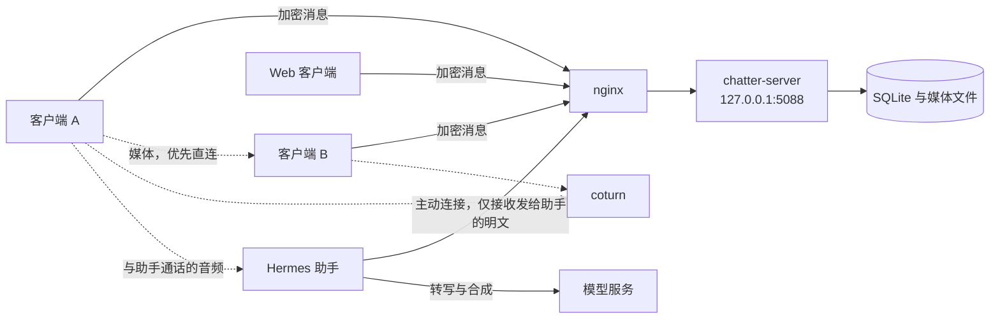

# lochatter

lochatter 是一套供两名用户使用的即时通讯系统，包含 Android 客户端、.NET 服务端、可选 Web 客户端，以及可选的 Hermes 助手插件。文本、图像、语音消息与文件默认在客户端完成端到端加密。服务端负责投递密文、保存密文媒体，以及转发通话信令，不解析消息正文。

当前版本：Android 2.5.0（`versionCode` 50），服务端 2.3.0。Android 包名 `ink.jvm.chatter`，安装包仅包含 `arm64-v8a`。许可证 [MIT](LICENSE)，版权所有 2026 laosaonan2。

[English](README.en.md)

2.2.0 不增加协议帧，也不增加消息类型。本版本规定运行参数的来源：服务进程从环境变量读取数据目录与可选能力；Android 构建把默认服务器地址写入安装包。域名、证书、密钥与推送凭据存放在被忽略的配置文件中，不进入版本库。

2.2.1 不修改协议与服务端。Android 表情面板在搜索框取得焦点、输入法弹出后保持打开，面板位于输入法上方。

2.2.2 不增加消息 `kind`，也不增加 WebSocket 帧。数据库 schema 仍为 9。网页改为手机扫码确认登录；令牌与密钥环只留在该次页面的内存中。Android `versionCode` 为 38。服务端 `Version` 为 `2.2.2`。

2.3.0 不增加消息 `kind`，也不增加 WebSocket 帧。数据库 schema 仍为 9。Android `versionCode` 为 40。服务端 `Version` 为 `2.3.0`。人类通话先经中转接通。仍为中转时，主叫约每 20 秒重新搜集候选地址；直连成功则切换媒体路径，失败则保持该次通话。TCP 中转仅作最后手段。通话字幕仅由本机麦克风在端侧生成，不发送。通话纪要默认关闭。用户打开后，本机模型只根据本机字幕生成纪要，不上传。助手通话不在本版本的变更范围内。网页在页面内存中解密后播放语音与视频，按解密后的文件名下载文件，图像与相册图片可放大查看。

2.3.1 不修改协议与服务端。Android `versionCode` 为 41。纪要模型在设置中单独下载。打开「挂断后整理纪要」不开始下载。模型未在本机就绪时，该开关保持关闭。

2.3.2 不修改协议与服务端。Android `versionCode` 为 42。纪要模型改从魔搭社区下载，不再使用需要许可令牌的 Hugging Face 地址。模型文件仍为 Gemma 3 1B int4。

2.3.3 不修改协议与服务端。Android `versionCode` 为 43。接通后仍从本机麦克风生成通话字幕，且不发送。拷贝录音数据时不再调用会在 Android 16 上令进程退出的 `ByteBuffer.array()`。

2.3.4 不修改协议与服务端。Android `versionCode` 为 44。通话字幕仍然保留。每次读取录音前须将缓冲区位置回到起点，拷贝时不得改动 WebRTC 正在使用的缓冲区。本机硬件回声消除与降噪关闭，改由 WebRTC 软件处理，以避免华为 Android 16 在开始录音时退出进程。

2.3.5 不修改协议与服务端。Android `versionCode` 为 45。通话字幕仍然保留。接通后约数毫秒，WebRTC 网络线程对空对象做虚调用并退出进程。本机网络监视器必须关闭。不得在候选地址尚未产生时预收集，也不得因传输类型变化再报一遍候选。持续收集与备用通路探测保持不变。

2.3.6 不修改协议与服务端。Android `versionCode` 为 46。通话字幕仍然保留。2.3.5 仍在设置本机描述时于同一地址退出。不得设置备用候选对探测间隔，也不得设置 STUN 保活间隔：连接对列表此时仍为空，本库会对该空项做虚调用。白板数据通道须在 ICE 接通之后创建。直连仍由之后的 ICE 重协商完成。本机网络监视器保持开启。

2.3.7 不修改协议与服务端。Android `versionCode` 为 47。接通顺序恢复为 2.2.0：主叫仍在首次 offer 之前创建白板数据通道；断线后的重协商仍按 2.2.0。人类通话仍先经中转接通，接通之后主叫才尝试直连。双方媒体接通之后才加载本机语音模型；模型未就绪则通话继续并提示，不得在通话中下载。模型加载完成之前，录音线程不得拷贝采样。加载完成之后，录音线程在交给发送路径之前把一份拷贝放入独立缓冲区，转写只读该缓冲区。缓冲区或 `AudioRecord` 为空时跳过该次拷贝。挂断时先关闭拷贝，再释放连接。通话字幕仍然保留，且不发送。

2.3.8 不修改协议与服务端。Android `versionCode` 为 48。已接听的人类通话若产生了本机字幕，挂断后直接展示按时间排列的文字记录，不自动调用纪要模型。用户点「总结摘要」后，本机模型才根据该记录生成纪要。模型未就绪时只提示先下载，不得因此开始下载。聊天页可让同一模型总结最近的双方文字、润色输入框草稿，或给出回复建议。这些内容不得上传。

2.4.0 不修改协议与服务端。Android `versionCode` 为 49。与对方的聊天页在输入栏提供「总结聊天」「润色」「建议回复」，不再使用输入栏上的 @助手。右上角保留语音通话、视频通话和助手入口；相册、收藏、纪念日、设置与消息定时销毁改由「我」或设置进入。手机不再发起或接听助手通话。页面切换与首页分页带有过渡。

2.5.0 不修改协议与服务端。Android `versionCode` 为 50。本机整理改用 Qwen，默认 Qwen3.5 4B，设置中可改选 Qwen3.5 2B 或 Qwen3 1.7B。权重从魔搭下载，不打进安装包。生成时逐字显示，用户可停止。这些文件只处理文字。详见 [protocol-2.5.md](docs/protocol-2.5.md)。

2.5.1 不修改协议与服务端。Android `versionCode` 为 51。与对方的聊天页右上角只留菜单。语音通话、视频通话和助手改从输入栏的加号进入。详见 [protocol-2.5.1.md](docs/protocol-2.5.1.md)。

2.5.2 不修改协议与服务端。Android `versionCode` 为 52。整理模型可改选 Qwen3.5 2B 的 GGUF，在骁龙 8 Gen 2、8 Gen 3 和 8 Elite 上走 Hexagon NPU。详见 [protocol-2.5.2.md](docs/protocol-2.5.2.md)。

2.5.3 不修改协议与服务端。Android `versionCode` 为 53。本机整理走 GPU。列出的骁龙机型上，Qwen3.5 2B 的 GGUF 走 Hexagon NPU。详见 [protocol-2.5.3.md](docs/protocol-2.5.3.md)。

2.5.4 不修改协议与服务端。Android `versionCode` 为 54。本机整理改用 MNN，可选 Qwen3 0.6B、1.7B、4B，默认 1.7B，走 GPU。用户也可填写云端接口。权重从魔搭下载，不打进安装包。详见 [protocol-2.5.4.md](docs/protocol-2.5.4.md)。

2.5.5 不修改协议与服务端。Android `versionCode` 为 55。本机模型在第一次整理时载入，界面写明正在载入，载好后留在内存里。详见 [protocol-2.5.5.md](docs/protocol-2.5.5.md)。

## 1. 客户端与账号

客户端要求 Android 8.0（`minSdk` 26）及以上。消息使用 WebSocket 传输，每帧一条 JSON。连接中断后，客户端按序号补齐缺失消息；未收到确认的消息以原 `id` 重发。服务端按 `id` 去重，不产生第二条记录。

系统最多注册两名人类用户。助手使用保留用户 id `0`，不占用上述名额。助手仅接收显式发给它的明文，不能读取两名用户之间的加密内容。

支持的内容包括文本、图像、语音消息、视频、文件、位置、相册图片、表情、拍一拍、引用、编辑、撤回、删除与清空。阅后即焚与定时销毁对双方同时生效。已读位置、输入状态、在线状态与电量通过同一条连接传递。

同一 IP 连续 5 次登录失败后锁定 5 分钟。设备令牌长期有效，服务端仅保存其 SHA-256。`chatterctl token revoke <名字>` 撤销该用户全部设备的令牌。

## 2. 端到端加密

每名用户持有一把 P-256 身份密钥。双方通过 ECDH 与 HKDF 导出相同的 AES-256-GCM 会话密钥。

文本（含说明文字、通话记录、表情回应，以及编辑后的新文本）使用前缀 `e2e:`。密钥大约每 7 日轮换一次，轮换后的密文使用前缀 `e2e2:`。图像与文件先整体加密再上传：旧格式为 `LCE1`，轮换后为 `LCE2`。加密上传时文件名同样为密文。

两名用户之间的 SDP 与 ICE 使用同一会话密钥加密。媒体由 WebRTC 的 DTLS-SRTP 保护，不经过聊天服务进程。无法解密的消息显示为「无法解密的消息」。任一方尚未发布公钥时，该条消息以明文发送。

身份私钥保留在客户端，并以 Android Keystore 中的 AES 密钥再加密。迁移使用设置中的二维码，内容前缀为 `lochatter1:`，密钥由 PBKDF2（200000 次）与 6 位 PIN 导出。Web 客户端与另一台手机导入的是同一设备令牌与同一密钥材料。

离线通知若选择附带原文，客户端将已导出的会话密钥提交给服务端，供接收方离线时解密该条通知。身份私钥不上报。若不允许服务端解密通知，应将样式改为仅提示有新消息，或关闭推送。

## 3. 通话与语音识别

两名用户之间的通话使用 WebRTC。优先直连；直连失败时使用 coturn。coturn 监听 UDP/TCP 3478，中继端口为 UDP 49160–49200。临时凭据按 `use-auth-secret` 签发，有效期约 6 小时。聊天服务只转发信令。

与助手的通话同样使用 WebRTC。音频位于手机与运行助手的主机之间。发给助手的 SDP 与 ICE 为明文，因为助手不持有两人会话密钥。聊天服务不转发该音频。

语音消息默认在设备上识别，引擎为 SenseVoice，模型约 230 MB。该路径与助手无关。仅当设置中的「语音识别」切换为云端时，语音消息才提交到服务端。`deploy/stt-setup.sh` 在服务器上安装只监听 `127.0.0.1:5090` 的 SenseVoice。进程空闲后退出，下一次请求再启动。

## 4. 离线通知

接收方仍有 WebSocket 连接时不发送外部通知，由客户端本地提醒。接收方没有任何连接时，服务端按该账号的配置，向 Server酱³ 或 MeoW 提交一条短文本。

样式为三种：仅提示有消息、附带原文、只报告条数。合并间隔为 0–86400 秒。0 表示每条都发送。接收方重新连接后，尚未发出的合并通知丢弃。

客户端以前台服务维持连接，并以约 5 分钟的唤醒与约 15 分钟的任务作为补充。操作系统推迟闹钟属于预期行为。

## 5. 助手与 Web 客户端

助手插件从助手所在主机主动连接聊天服务，聊天服务不向该主机发起反向连接。发给助手的消息必须为明文；前缀为 `e2e:` 的文本与已加密的文件会被拒绝。流式回复通过编辑同一条消息完成。

与助手的语音通话要求插件加载 aiortc，并配置 OpenAI 兼容的模型服务，分别用于转写与合成。模型标识必须是该服务实际提供的标识。字幕使用帧 `call.caption`。

部署完成后，Web 客户端位于 `https://<域名>/web/`。页面显示二维码，已登录的手机在设置中选择「登录网页版」并确认。确认后的设备令牌与密钥环只留在该次页面的内存中，不写入浏览器存储。刷新或关闭页面后须重新扫码。页面显示文本、图像、相册图片、语音与视频，文件按解密后的文件名下载。位置、通话与表情仍显示为一行摘要。浏览器无法在 WebSocket 握手中设置 `Authorization` 头，因此当次页面把令牌放进名为 `chatter` 的会话 cookie，并在下次加载时清除。其余接口仍使用 Bearer 令牌。令牌不得放入 URL，否则会进入 nginx 访问日志。手机须安装 2.2.2 及以上，设置中才有「登录网页版」。

## 6. 部署结构



实线为聊天数据。虚线为通话媒体，不写入 SQLite。

## 7. 目录

| 路径 | 内容 |
|---|---|
| `android/` | Android 客户端。Kotlin，Jetpack Compose |
| `server/` | 聊天服务。.NET 10，Native AOT。同目录含可选的云端转写进程 |
| `web/` | Web 客户端。部署时复制到 `/var/www/chatter/web` |
| `deploy/` | 发布、nginx、TURN 与备份脚本 |
| `hermes/lochatter/` | 助手插件 |
| `docs/` | 协议与版本说明 |
| `tools/` | 本地协议检查脚本 |

协议基线为 [docs/protocol.md](docs/protocol.md)。`docs/protocol-1.3.md` 至 `docs/protocol-2.2.md` 记录后续增加的帧与字段，实现时须同时阅读。各版本已发布行为见 [docs/roadmap.md](docs/roadmap.md)。2.1 的原计划是助手加入双人通话；已发布的 2.1 与 2.1.2 为离线通知，以及每名用户独立的头像与签名。三方通话未实现。

## 8. 配置

版本库只包含 `*.example`。填写后的文件列在 `.gitignore` 中。

聊天进程读取下表中的环境变量。`deploy/chatter.service` 额外加载三个环境文件；文件不存在时 systemd 跳过，对应能力关闭。`/etc/chatter/deploy.env` 只供 shell 脚本使用，不注入聊天进程。

| 变量 | 位置 | 作用 |
|---|---|---|
| `CHATTER_DATA` | 单元内，值为 `/var/lib/chatter` | 数据库与媒体目录 |
| `ASPNETCORE_URLS` | 单元内，值为 `http://127.0.0.1:5088` | 仅监听本机。TLS 由 nginx 终止 |
| `CHATTER_TURN_HOST`、`CHATTER_TURN_SECRET` | `/etc/chatter/turn.env` | 通话中继。通常由 `turn-setup.sh` 生成 |
| `CHATTER_STT_URL`、`CHATTER_STT_KEY`、`CHATTER_STT_MODEL` | `/etc/chatter/stt.env` | 云端转写。未设置 `CHATTER_STT_URL` 时不提供 `POST /stt` |
| `CHATTER_AMAP_KEY`、`CHATTER_TILES` | `/etc/chatter/geo.env` | 地名检索。`CHATTER_TILES=amap` 时瓦片为 GCJ-02，其他值或未设置为 WGS-84 |
| `CHATTER_DOMAIN`、`CHATTER_SSL_DIR` | `/etc/chatter/deploy.env` | nginx 站点名与证书目录名。证书文件不在版本库中 |
| `CHATTER_SERVER_URL` | 构建环境，可省略 | 写入新安装包的默认服务器地址。未设置时依次使用 `android/server.properties` 与 `https://$CHATTER_DOMAIN` |

本机运维脚本 `healthcheck.sh`、`nas-backup-pull.sh` 读取 `deploy/local.env`。键与服务器上的 `deploy.env` 相同，并增加 `CHATTER_HOST`、`CHATTER_SSH_PORT`。`CHATTER_EXTRA_BACKUP` 为备份时附加执行的 shell 命令，其标准输出保存为 `extra.dump`。

助手插件的变量见 `hermes/lochatter/env.example`。`LOCHATTER_TOKEN` 由 `chatterctl bot token` 生成，只显示一次。`LOCHATTER_HUB_BASE` 仅用于语音通话。

## 9. 部署

下列命令中的 `chat.example.com` 为占位域名。证书须事先签发。

目标系统为带 systemd 的 Linux，并安装 nginx、git、sqlite3 与 .NET 10 SDK。`deploy.sh` 使用 `DOTNET_ROOT=/usr/share/dotnet`。

```bash
install -d -m 755 /etc/chatter
cat > /etc/chatter/deploy.env << 'EOF'
CHATTER_DOMAIN=chat.example.com
CHATTER_SSL_DIR=chat.example.com
EOF
chmod 600 /etc/chatter/deploy.env

# 证书路径：
#   /etc/nginx/ssl/chat.example.com/fullchain.pem
#   /etc/nginx/ssl/chat.example.com/key.pem

git clone https://github.com/jiayunlimailutorontoca/lochatter.git /opt/chatter/src
bash /opt/chatter/src/deploy/deploy.sh
```

`deploy.sh` 获取源码，执行 Native AOT 发布，替换 `/opt/chatter/rel`，保留上一份 `/opt/chatter/rel.old`，安装 systemd 单元，按 `deploy.env` 生成 nginx 站点，创建系统用户 `chatter` 与数据目录 `/var/lib/chatter`，然后重启服务。进程用户为 `chatter`，内存上限 300 MB。

若已有独立裸仓库，将其地址写入 `CHATTER_REPO`。未设置且 `/opt/chatter/src` 不存在时，脚本克隆 `/srv/git/chatter.git`。目录已是工作副本时，脚本只对该副本的 `origin` 执行 `git fetch`。

```bash
curl -s http://127.0.0.1:5088/healthz
systemctl status chatter
```

`/healthz` 返回的 `version` 应为 `2.3.0`。nginx 配置无效时，脚本输出 `nginx -t` 的错误且不执行 reload。防火墙至少放行 TCP 443。通话另需放行 UDP/TCP 3478 与 UDP 49160–49200。

```bash
bash /opt/chatter/src/deploy/turn-setup.sh
systemctl restart chatter
chatterctl user add 甲
chatterctl user add 乙
```

省略密码时，命令打印生成的密码。人类用户上限为 2。其余子命令包括 `user list`、`user passwd`、`token revoke`、`bot token`、`bot revoke`、`notify list`、`notify set`。不带参数执行 `chatterctl` 可查看用法。

云端转写与地图均为可选项。未设置 `CHATTER_AMAP_KEY` 时，位置消息仍可发送经纬度，但不返回地名。

```bash
bash /opt/chatter/src/deploy/stt-setup.sh
systemctl restart chatter
```

备份：

```bash
bash /opt/chatter/src/deploy/maintenance-cron.sh
```

每日 03:17 将 SQLite 在线备份、媒体目录与 `/etc/chatter` 写入 `/var/backups/chatter/<日期>/`，保留 7 日。另一台主机使用 `deploy/nas-backup-pull.sh` 拉取该目录。`deploy/healthcheck.sh` 探测 `/healthz`，连续失败后通过 SSH 重启 `chatter`。主机与端口取自 `local.env`。

## 10. 构建 Android 安装包

构建机需要 JDK 17、Android SDK 35 与 Gradle 8.9。版本库不包含 Gradle Wrapper。

```bash
cd android
cp local.properties.example local.properties
cp server.properties.example server.properties
cp keystore.properties.example keystore.properties
gradle :app:assembleRelease
```

发布构建启用 R8 与资源压缩。未提供 `keystore.properties` 时使用调试签名，该产物只用于本机安装。

若源码位于网盘同步目录，占位文件会导致 Gradle 拒绝建立快照。可将输出目录写到其他磁盘，配置位于 `~/.gradle/gradle.properties`：

```
chatter.buildDir=C:/somewhere
```

也可在服务器上构建。先执行一次 `deploy/android-toolchain.sh`，再执行 `deploy/android-build.sh`。脚本根据 `CHATTER_DOMAIN` 导出 `CHATTER_SERVER_URL`，并把更新描述写入 `/var/www/chatter/latest.json`。

首次启动时，服务器地址为构建期写入的默认值。两台设备分别登录两个账号。已安装的客户端保留本地保存的地址，升级不覆盖该值。

## 11. 验证

```bash
bash tools/check.sh --e2e
cd android && gradle :app:testReleaseUnitTest
```

`tools/e2e.py`、`tools/wstest.py`、`tools/turntest.py` 的地址与账号通过参数传入，不写入脚本。

## 12. 限制

- 人类账号上限为 2。安装包仅含 `arm64-v8a`。
- 任一方没有公钥时，对应消息为明文。
- 选择附带原文的离线通知时，会话密钥会提交给服务端。
- 助手加入双人实时通话尚未实现。
- Web 客户端不实现语音消息、通话与助手操作。
