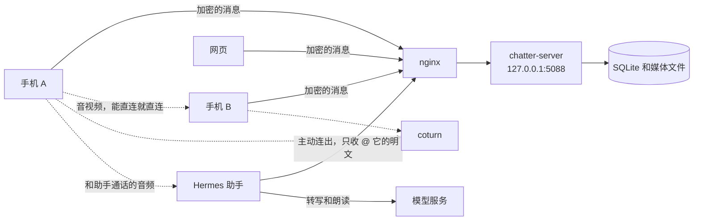

# lochatter

两个人用的聊天。手机对手机，文字、图片、语音条和文件默认端到端加密。服务器只负责把密文递过去，看不到正文。

当前版本 2.1.2。Android 包名 `ink.jvm.chatter`，只打 arm64。许可证是 [MIT](LICENSE)，版权 2026 laosaonan2。

[English](README.en.md)

## 它解决什么

不想把两个人的日子放进别人的账号体系里。账号只有两个，再加一个可选的助手。助手只能看见你特意 @ 它的明文，看不见你们俩的加密聊天。

手机是 Android 8.0 及以上。服务器是一个 C# 程序，编译成 Native AOT，只听 `127.0.0.1:5088`。外面用 nginx 做 TLS。网页能发文字和图片，密钥从手机上的二维码带过去。

## 聊天

消息走 WebSocket，一条一个 JSON。断线之后按序号把缺的补上，没确认的按原来的 id 重发，不会变成两条。

能发文字、图片、语音条、视频、文件、位置、表情回应、引用、编辑、撤回、清空。阅后即焚和定时销毁是双方一起生效的。已读、正在输入、在线状态也在这条连接上。

账号最多两个。同一个 IP 连续输错 5 次密码，锁 5 分钟。令牌是长期的，服务端只存它的哈希。`chatterctl token revoke 名字` 可以让这个人的所有设备下线。

## 加密

每个人有一把 P-256 身份密钥。两边用 ECDH 再经 HKDF 推出同一把 AES-256-GCM 会话密钥。

- 文字（包括说明、通话记录、表情回应、编辑后的新文本）以 `e2e:` 开头。大约每周换一期密钥，新的密文是 `e2e2:`。
- 图片和文件整段加密后上传，旧格式 `LCE1`，换期之后是 `LCE2`。服务器只看到密文，文件名也是密文。
- 两个人通话时的 SDP 和 ICE 用同一把会话密钥加密。媒体本身走 WebRTC 的 DTLS-SRTP，不经过聊天服务器。

解不开时，界面上是「无法解密的消息」。任何一边还没有密钥，这条消息就是明文发出去的，没有第二层保护。

身份私钥留在手机上，用 Android Keystore 里的 AES 保护。换机靠设置里的二维码：`lochatter1:`，PBKDF2 二十万次，旁边一个 6 位 PIN。网页和另一台手机扫的是同一把令牌、同一套密钥。

有一个例外。离线推送如果选「带上原文」，手机会把已经算好的会话密钥交给服务器，让它在你不在线时解开这一条再推出去。身份私钥不会上传。不想这样，就把样式改成只说有消息，或者关掉推送。

## 通话

两人通话是 WebRTC。能直连就直连，不行就走 coturn（UDP/TCP 3478，中继 UDP 49160–49200）。临时凭证按 `use-auth-secret` 签，大约 6 小时。服务器只转发信令，看不到音视频。

和助手的通话也是 WebRTC，音频在手机和跑助手的那台机器之间。给助手的 SDP / ICE 是明文，因为助手要自己建连接。聊天服务器仍然不转发音频。

## 语音转文字

语音条默认在手机上识别（SenseVoice，模型大约 230 MB）。这和助手不是一回事。

设置里的「语音识别」打开云端之后，才把语音条交给服务器。服务器上的 `deploy/stt-setup.sh` 会装一个只听本机 `127.0.0.1:5090` 的 SenseVoice。平时它空闲一会儿就退出，下一次请求再拉起来。

## 不在线时

对方还有 WebSocket 连着，就不推送，手机自己会响。一个连接都不在的时候，按收件人自己的设置，把一条短文字交给 Server酱³ 或 MeoW。

样式三种：只说有消息、带上原文、只报条数。合并间隔 0 到 86400 秒，0 是每条都推。人重新连上，还没发出去的合并就丢掉。

手机这边用前台服务撑着，另外有大约 5 分钟一次的唤醒和大约 15 分钟一次的任务，尽量在省电策略下把连接拉回来。系统把闹钟推迟是正常的。

## 助手

可以不装。装的话，Hermes 插件从内网主动连出来，不需要给服务器开反向端口。它的用户 id 是 0，不占那两个名额。

发给它的消息必须是明文，加密的文字和加密的文件会被拒绝。它看不到你们之间的 `e2e:` / `e2e2:`。回复改同一条气泡，所以看起来是在往外长。

和它打电话需要插件里的 aiortc，以及一个 OpenAI 兼容的模型服务，用来转写和朗读。模型名填那台服务实际有的，不要猜。字幕走 `call.caption`。

## 网页

部署之后在 `https://你的域名/web/`。同一套协议，只做文字和图片，其它类型显示一行摘要。浏览器的 WebSocket 带不上 `Authorization` 头，所以握手用 cookie `chatter`，别的接口仍然用 Bearer。令牌不要写进 URL，不然会进 nginx 日志。

## 怎么串起来



实线是聊天。虚线是通话的媒体，不进 SQLite。

## 仓库里有什么

| 目录 | 内容 |
|---|---|
| `android/` | 手机客户端，Kotlin、Jetpack Compose |
| `server/` | 聊天服务，.NET 10，Native AOT。旁边还有可选的云端转写进程 |
| `web/` | 网页，部署时拷到 `/var/www/chatter/web` |
| `deploy/` | 在服务器上编译、装 nginx、TURN、备份 |
| `hermes/lochatter/` | 助手插件，从助手那台机器往外拨 |
| `docs/` | 协议和各版本的设计笔记 |
| `tools/` | 本机对一下协议用的小脚本 |

协议以 [docs/protocol.md](docs/protocol.md) 为底。后面的 `docs/protocol-1.3.md` 到 `docs/protocol-2.1.md` 是增量，不要只看最新一份。路线图在 [docs/roadmap.md](docs/roadmap.md)。里面 2.1 那一行曾经写「助手加入两人通话」，后来发出去的 2.1 / 2.1.2 其实是离线推送，加上每个人自己的头像和签名。助手加入通话还没做。

## 配置不要提交

域名、证书目录、密钥、推送 SendKey、助手令牌都放在配置文件里。仓库里只有 `*.example`。填好的那份在 `.gitignore` 里。

| 你要复制的例子 | 复制成 | 干什么 |
|---|---|---|
| `android/server.properties.example` | `android/server.properties` | 新安装时预填的服务器地址。已经装过的手机沿用它自己存的地址 |
| `android/local.properties.example` | `android/local.properties` | Android SDK 路径 |
| `android/keystore.properties.example` | `android/keystore.properties` | 正式包签名。没有它就用 debug 签名 |
| `deploy/local.env.example` | `deploy/local.env` | 你这台电脑上的域名、证书目录、SSH |
| 同一份键 | `/etc/chatter/deploy.env` | 服务器上的同一组设置，外加可选的额外备份命令 |
| `deploy/turn.env.example` | `/etc/chatter/turn.env` | TURN 密钥。一般让 `turn-setup.sh` 写 |
| `deploy/stt.env.example` | `/etc/chatter/stt.env` | 云端转写。一般让 `stt-setup.sh` 写 |
| `deploy/geo.env.example` | `/etc/chatter/geo.env` | 地图 key。不用高德就留空 |
| `hermes/lochatter/env.example` | 插件自己的环境 | 助手令牌和模型名 |

服务器上的 systemd 单元会读 `turn.env`、`geo.env`、`stt.env`。文件不存在就跳过，对应功能不开。

## 部署

下面用 `chat.example.com` 代替你的域名。证书要事先签好。

### 服务器

一台有 systemd 的 Linux。需要 nginx、git、sqlite3，以及 .NET 10 SDK。`deploy.sh` 写死了 `DOTNET_ROOT=/usr/share/dotnet`，dotnet 要在这个目录里。

```bash
# 证书目录名如果跟域名不一样，两个都写上。这个文件不要进 git。
install -d -m 755 /etc/chatter
cat > /etc/chatter/deploy.env << 'EOF'
CHATTER_DOMAIN=chat.example.com
CHATTER_SSL_DIR=chat.example.com
EOF
chmod 600 /etc/chatter/deploy.env

# 证书放这里：
#   /etc/nginx/ssl/chat.example.com/fullchain.pem
#   /etc/nginx/ssl/chat.example.com/key.pem

git clone https://github.com/jiayunlimailutorontoca/lochatter.git /opt/chatter/src
bash /opt/chatter/src/deploy/deploy.sh
```

`deploy.sh` 会做这些事：拉代码，Native AOT 发布，换掉 `/opt/chatter/rel` 并留下上一份 `/opt/chatter/rel.old`，装 systemd 单元，按 `deploy.env` 生成 nginx 站点，建系统用户 `chatter` 和数据目录 `/var/lib/chatter`，然后重启。进程以 `chatter` 用户跑，内存上限 300 MB，数据在 `CHATTER_DATA=/var/lib/chatter`。

已经有自己的裸仓库时，把仓库地址写进 `CHATTER_REPO`。没写的话，脚本在 `/opt/chatter/src` 还不存在时会去克隆 `/srv/git/chatter.git`。目录已经是一份检出时，它只 `git fetch` 这份检出的 origin。

装完看一眼：

```bash
curl -s http://127.0.0.1:5088/healthz
systemctl status chatter
```

nginx 没配好时，脚本会打印 `nginx -t` 的错误，并且不 reload。先把证书路径改对再跑一次。

防火墙至少放行 443。通话还要放行 UDP/TCP 3478 和 UDP 49160–49200。

### 通话中转

```bash
bash /opt/chatter/src/deploy/turn-setup.sh
systemctl restart chatter
```

它会装 coturn，并在 `/etc/chatter/turn.env` 里写一把随机密钥和公网 IP。文件已经存在就不会覆盖。

### 账号

```bash
chatterctl user add 甲
chatterctl user add 乙
```

不写密码就会打印一个。最多两个人。助手令牌：

```bash
chatterctl bot token
```

这行只显示一次，填进助手插件的 `LOCHATTER_TOKEN`。

常用的还有 `chatterctl user list`、`user passwd`、`token revoke`、`bot revoke`、`notify list`、`notify set`。直接跑 `chatterctl` 能看到用法。

### 手机

本机需要 JDK 17、Android SDK 35、Gradle 8.9 左右。仓库里没有 Gradle Wrapper。

```bash
cd android
cp local.properties.example local.properties
cp server.properties.example server.properties
cp keystore.properties.example keystore.properties
# 改 sdk.dir、serverUrl，以及签名密码
gradle :app:assembleRelease
```

正式包开了 R8 和资源压缩。没有 `keystore.properties` 时用 debug 签名，只能自己装着玩。

网盘同步目录有时会把文件变成占位符，Gradle 会拒绝。可以把编译输出指到别的盘：

```
chatter.buildDir=C:/somewhere
```

写在用户目录的 `~/.gradle/gradle.properties` 里。

也可以在服务器上编。先跑一次 `deploy/android-toolchain.sh`，再跑 `deploy/android-build.sh`。下载地址写进 `/var/www/chatter/latest.json`，手机里的更新检查读这个文件。

第一次打开，把服务器地址填成 `https://chat.example.com`（或者你在 `server.properties` 里写的那个）。两台手机分别登录两个账号。

### 云端转写，可选

```bash
bash /opt/chatter/src/deploy/stt-setup.sh
systemctl restart chatter
```

手机默认仍在本地识别。

### 地图，可选

地点搜索要用高德 Web 服务 key，写在 `/etc/chatter/geo.env` 的 `CHATTER_AMAP_KEY`。`CHATTER_TILES=amap` 时瓦片是 GCJ-02，否则是 WGS-84。不配的话，位置分享仍然能发经纬度，只是没有那家的地名。

### 助手，可选

把 `hermes/lochatter` 放进 Hermes 的插件目录，环境变量照 `hermes/lochatter/env.example`。`LOCHATTER_URL` 是聊天服务器，`LOCHATTER_HUB_BASE` 只在语音通话时用。改完重启 Hermes，日志里能看到连上。

### 备份

```bash
bash /opt/chatter/src/deploy/maintenance-cron.sh
```

每天 03:17 把 SQLite（在线备份）、媒体和 `/etc/chatter` 打到 `/var/backups/chatter/日期/`，留 7 天。命令是 `chatter-backup`。还要多备份别的东西时，在 `/etc/chatter/deploy.env` 里设 `CHATTER_EXTRA_BACKUP`，那条命令的标准输出会存成 `extra.dump`。

另一台机器可以用 `deploy/nas-backup-pull.sh` 把 `/var/backups/chatter/` 拉走。主机和端口读脚本旁边的 `local.env`，见 `deploy/local.env.example`。

`deploy/healthcheck.sh` 每隔几分钟探一次 `/healthz`，连续失败就 ssh 过去重启 `chatter`。同样读 `local.env`。

## 开发时对一下

服务端测试和一轮端到端：

```bash
bash tools/check.sh --e2e
```

手机端：

```bash
cd android
gradle :app:testReleaseUnitTest
```

协议探针是 `tools/e2e.py`、`tools/wstest.py`、`tools/turntest.py`，地址和账号当参数传，不要写进脚本。

## 限度

- 人类账号最多两个。
- 安装包只有 arm64-v8a。
- 一边没有密钥，消息就是明文。
- 「带上原文」的离线推送会把会话密钥交给服务器。
- 助手加入两个人的实时通话还没做。路线图里那一格是旧计划。
- 网页没有语音、通话和助手操作。
